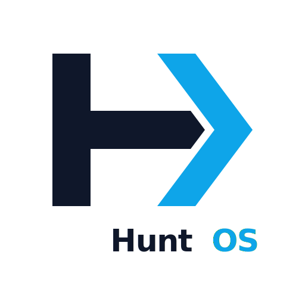

<p align="center">
  
</p>

<h1 align="center">HuntOS</h1>

<p align="center">
  <strong>Automated job application OS — powered by AI agents, browser automation, and a fully local stack.</strong>
</p>

<p align="center">
  
  
  
  
  
</p>

---

## What is HuntOS?

HuntOS is a local-first, agent-driven job application platform. It combines a SvelteKit UI, Mastra AI agents, and Chrome DevTools Protocol automation to research job listings, tailor resumes, and submit applications — while you focus on what matters.

| Capability | Details |
|---|---|
| **Job board scraping** | LinkedIn, Greenhouse, and generic boards |
| **Resume generation** | Agent-tailored Markdown + PDF per application |
| **Browser automation** | Full CDP-driven form filling and submission |
| **Kanban pipeline** | Track every application from research to offer |
| **Audit trail** | Per-run annotated screenshots and action logs |
| **Fully local** | SQLite databases, no cloud storage required |

---

## Prerequisites

| Requirement | Notes |
|---|---|
| **bun** | Package manager and script runner |
| **Node.js** | Required by some tooling (bundled with bun) |
| **Google Chrome** (`google-chrome-stable`) | Browser-driven agent automation via CDP |
| **curl**, **lsof**, **jq** | Used by the Chrome CDP bootstrap script |

---

## Installation

```bash
bun install
```

Copy the example environment file and fill in your API keys:

```bash
cp .env.example .env
```

---

## Starting the app

A single command starts everything:

```bash
bun start
```

This runs `run-pty` with `run-pty.json`, launching three services in an interactive terminal dashboard:

| Tile | Script | What it does |
|---|---|---|
| **Chrome CDP** | `scripts/chrome-cdp.sh` | Clears port `:9222`, starts Chrome with remote debugging, waits for readiness, connects the agent-browser session, then keeps Chrome alive |
| **Dev Server** | `scripts/dev.sh` | Starts the Vite / SvelteKit dev server on `:5173` |
| **Mastra Studio** | `scripts/studio.sh` | Starts Mastra Studio on `:4111` for agent and workflow inspection |

### Dashboard controls

| Key | Action |
|---|---|
| `1` / `2` / `3` | Focus a service tile |
| `Ctrl+Z` | Return to the dashboard overview |
| `Ctrl+C` | Kill the focused service (or all from the dashboard) |
| `Enter` | Restart an exited service |

All services shut down cleanly on `Ctrl+C` — no dangling processes or blocked ports.

### Running services individually

```bash
bun run chrome    # Chrome + CDP handshake only
bun run studio    # Mastra Studio only
bun run dev       # Vite dev server only
```

---

## URLs

| Service | URL |
|---|---|
| **HuntOS App** | http://localhost:5173 |
| **Mastra Studio** | http://localhost:4111 |

---

## Scripts reference

### `scripts/`

| File | Purpose |
|---|---|
| `scripts/chrome-cdp.sh` | Starts Chrome with CDP, connects agent-browser, keeps Chrome alive |
| `scripts/dev.sh` | Starts the Vite dev server (`bun run dev`) |

### `package.json` scripts

| Command | What it runs |
|---|---|
| `bun start` | `bunx run-pty run-pty.json` — full interactive dashboard |
| `bun run dev` | Vite dev server directly |
| `bun run build` | Production build |
| `bun run preview` | Preview production build |
| `bun run chrome` | `scripts/chrome-cdp.sh` — Chrome + CDP connect |
| `bun run studio` | Mastra Studio |
| `bun run ab` | `agent-browser` CLI passthrough |
| `bun run check` | SvelteKit sync + svelte-check |
| `bun run lint` | Prettier + ESLint |
| `bun run format` | Prettier write |

---

## Environment / model configuration

All model and provider settings live in `.env`. See `.env.example` for the full list.

### Key variables

| Variable | Purpose |
|---|---|
| `DEFAULT_MODEL` | Fallback model when no agent override is set |
| `PROFILE_AGENT_MODEL` | Model for the profile agent |
| `RESUME_AGENT_MODEL` | Model for the resume agent |
| `JOB_APPLICATION_AGENT_MODEL` | Model for the browser-driven application agent |
| `JOB_BOARD_AGENT_MODEL` | Model for job board scraping agents |
| `JOB_BOARD_LINKEDIN_MODEL` | *(Optional)* LinkedIn-specific override |
| `JOB_BOARD_GREENHOUSE_MODEL` | *(Optional)* Greenhouse-specific override |
| `JOB_BOARD_GENERIC_MODEL` | *(Optional)* Generic board override |

### Supported providers

Model strings use the format `<provider>/<model-id>`, e.g. `openrouter/qwen/qwen3-30b-a3b-instruct-2507`.

| Provider prefix | Required env var | Notes |
|---|---|---|
| `openrouter/` | `OPENROUTER_API_KEY` | |
| `openai/` | `OPENAI_API_KEY` | |
| `lmstudio/` | `LMSTUDIO_BASE_URL` | Usually `http://127.0.0.1:1234/v1` |
| `github-models/` | `GITHUB_TOKEN` | |
| `ollama/` | `OLLAMA_BASE_URL` | Usually `http://localhost:11434/api` |
| `z-ai/` | `ZAI_API_KEY` | Falls back to OpenRouter if key not set |

Provider wiring lives in `src/lib/mastra/providers/registry.ts`.

---

## Application layout

```
src/
  lib/
    mastra/          # Mastra agents, tools, prompts, provider registry
    services/        # Backend services (DB, pipeline, email, job boards, …)
    components/      # Shared Svelte components
    stores/          # Svelte stores
  routes/
    applications/    # Kanban board and application detail
    profiles/        # User profile editor
    resume/          # Resume generation and template management
    audit/           # Audit log viewer
    settings/        # Settings pages
      email/
      job-boards/
      resume/
      admin/         # Admin panel
    api/             # SvelteKit API endpoints

scripts/             # Individual service start scripts
run-pty.json         # run-pty service definitions
static/              # Favicon set, logo, web manifest
data/                # Local runtime data (gitignored)
  app.db             # Main SQLite database
  memory.db          # Mastra memory database
  resumes/           # Generated resume files (.md + .pdf)
  user-resources/    # User-uploaded documents
  logs/
    screenshots/     # Per-run annotated screenshots from the browser agent
```

---

## Admin panel

Navigate to **Settings → Admin** (`/settings/admin`) for internal tooling:

### Database tab

- Lists all SQLite tables with row counts
- Click a table to browse rows (paginated, 100 per page, newest first)
- **Double-click any cell** to edit it inline
- **Wipe** button to delete all rows from a table (with confirmation)

### Server Logs tab

- Live-streams log output via SSE from the server process
- Switch between **Dev Server**, **Mastra Studio**, and **Chrome** log sources
- Colour-coded output (red = errors, yellow = warnings, green = ready/success)
- Auto-scroll toggle, clear, and scroll-to-bottom controls

### Data Files tab

- Browses `data/resumes/`, `data/logs/screenshots/`, and `data/user-resources/`
- Screenshots bucket walks nested run subdirectories automatically
- Click any file to preview inline (images, PDFs, text/markdown)
- Download or delete individual files

---

## Audit log

The **Audit Log** page (`/audit`) records every significant automated action:

- Job board scraping runs
- Browser agent iterations (with per-iteration annotated screenshots)
- Resume generation
- Profile updates
- Pipeline steps (research → resume → apply)

Expanding an audit entry shows the full detail, metadata, and — for browser agent entries — a **screenshot strip** of every iteration captured during that run. Click any thumbnail to open a full-screen lightbox with keyboard navigation (`←` / `→` / `Esc`).

---

## Data storage

Everything is stored locally — no cloud dependency beyond the LLM API calls you configure.

| Path | Contents |
|---|---|
| `data/app.db` | Main application database (applications, profiles, audit logs, …) |
| `data/memory.db` | Mastra agent memory (conversation history, embeddings) |
| `data/resumes/` | Generated resumes as `.md` and `.pdf` pairs |
| `data/user-resources/` | Documents you upload for the agents to reference |
| `data/logs/screenshots/` | Annotated browser screenshots, one subdirectory per pipeline run |
| `data/chrome/` | Chrome user data directory for the CDP session |

---

## Troubleshooting

**Chrome won't start / port 9222 already in use**
`scripts/chrome-cdp.sh` evicts any existing process on `:9222` before starting. If it still fails, check `data/chrome.log` or the Chrome CDP tile output in the run-pty dashboard.

**`agent-browser connect` fails**
Make sure `agent-browser` is installed (`bun install`) and that Chrome is fully up before the connect step. The script waits for the port to accept connections before attempting the connect.

**Missing API key errors**
Copy `.env.example` to `.env` and fill in the keys for the providers you intend to use.

**`z-ai/` model errors**
If `ZAI_API_KEY` is not set, `z-ai/` model strings are routed through OpenRouter — ensure `OPENROUTER_API_KEY` is set.

**LMStudio / Ollama not reachable**
Set `LMSTUDIO_BASE_URL` or `OLLAMA_BASE_URL` in `.env` to point at your local server.

---

<p align="center">
  <sub>Built with SvelteKit · Mastra · Bun · TailwindCSS · Skeleton UI</sub>
</p>
